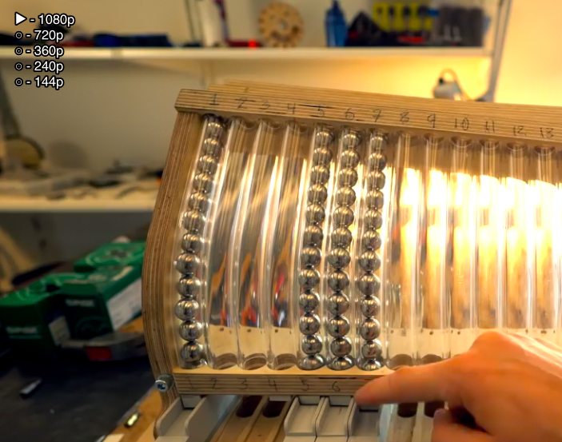

# youtube-quality
A userscript for MPV that allows you to change youtube video quality (ytdl-format) on the fly, as though you were using the web player.

Toggle the menu with ctrl+f (configurable).   Select from the list with the arrow keys (configurable), and press enter (configurable) to select.  Menu times out after 10 seconds (configurable.)

## Installation
Copy youtube-quality.lua into your scripts directory, e.g.:

    cp youtube-quality.lua ~/.config/mpv/scripts/
optional, copy the config file:

    cp youtube-quality.conf ~/.config/mpv/script-opts/

## OSC extension
**Completely optional**, an extended version of the OSC is available that includes a button to display the quality menu.  To use this, copy the youtube-quality-osc.lua file into your scripts directory and put `osc=no` in your mpv.conf.

**PLEASE NOTE:** This conflicts with other scripts that modify the OSC, such as TheAMM's excellent [mpv_thumbnail_script](https://github.com/TheAMM/mpv_thumbnail_script).  Merging this OSC modification with that script or others is certainly possible, *but is left as an exercise for the user...*

## Plans For Future Enhancement
- [x] Visual indication of what the current quality level is.
- [x] Option to populate the quality list automatically with the exact formats available for a given video.
- [x] Optional OSC extension.
- [ ] *\[your suggestion here\]*

## Credit
- [reload.lua](https://github.com/4e6/mpv-reload/), for the function to reload a video while preserving the playlist.
- [mpv-playlistmanager](https://github.com/jonniek/mpv-playlistmanager), from which I ripped off much of the menu formatting config.
- ytdl_hook.lua, from which I ripped off much of the youtube-dl code to fetch the format list
- somebody on /mpv/ for the idea
