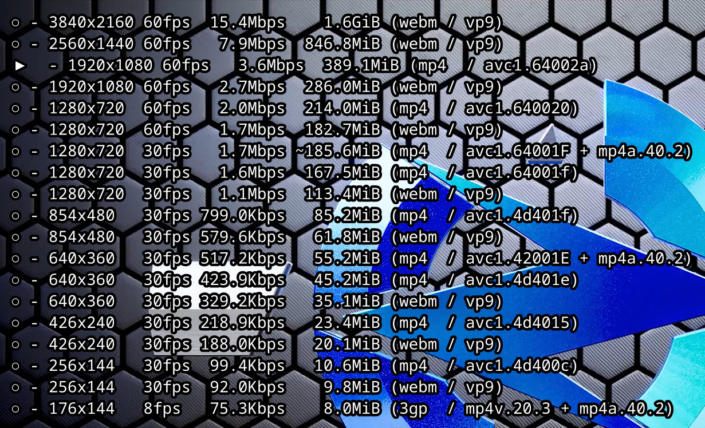
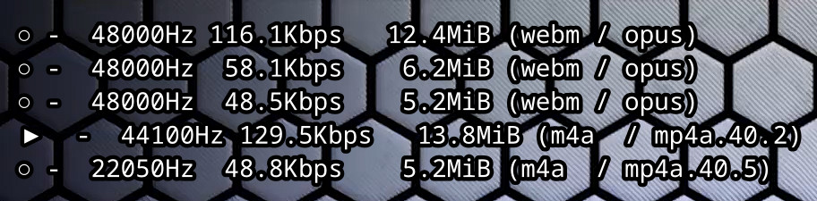
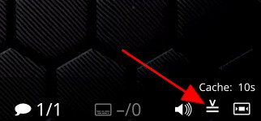

# quality-menu
A userscript for MPV that allows you to change the streamed video and audio quality (ytdl-format) on the fly.

Simply open the video or audio menu, select your prefered format and confirm your choice. The keybindings for opening the menus are configured in input.conf, and everthing else is configured in quality-menu.conf.





## Features

- Columns and their order are configurable
- All format related information from yt-dlp/youtube-dl can be shown
- Columns that are identical for all formats are automatically hidden
- Formats can be sorted based on resolution, fps, bitrate, etc.
- Currently playing format is marked and selected when opening the menu
- Indentation makes it easy to see which line you're currently on
- Remembers selected format for every url in the current session (e.g. going back to previous playlist item automatically selects the prefered format)
- Controllable entirely by mouse and keyboard (opening and closing the menu by mouse requires the OSC extension)
- Simple reload functionality (for something more sophisticated, go to [reload.lua](https://github.com/4e6/mpv-reload/))
- Integration into [uosc](https://github.com/tomasklaen/uosc) for opening a graphical menu instead of the purely text based one.  
    Note: This requires uosc 3.2.0 or newer, which has not been released yet.

## OSC extension
**(optional)** An extended version of the OSC is available that includes a button to display the quality menu.



**PLEASE NOTE:** This conflicts with other scripts that modify the OSC, such as marzzzello's fork of the excellent [mpv_thumbnail_script](https://github.com/marzzzello/mpv_thumbnail_script).  Merging this OSC modification with that script or others is certainly possible, *but is left as an exercise for the user...* (hint: There are two sections markt with `START quality-menu` and `END quality-menu`)


## Installation
1. Save the `quality-menu.lua` into your [scripts directory](https://mpv.io/manual/stable/#script-location)
2. Set key bindings in [`input.conf`](https://mpv.io/manual/stable/#input-conf):

    `Ctrl+f script-binding quality_menu/video_formats_toggle`

    `Alt+f script-binding quality_menu/audio_formats_toggle`

    **(optional)** `Ctrl+r script-binding quality_menu/reload`

3. **(optional)** Save the `quality-menu.conf` into your `script-opts` directory (next to the [scripts directory](https://mpv.io/manual/stable/#script-location), create if it doesn't exist)
4. **(optional)** Save the `quality-menu-osc.lua` into your [scripts directory](https://mpv.io/manual/stable/#script-location)  and put `osc=no` in your [mpv.conf](https://mpv.io/manual/stable/#location-and-syntax)

## API
This was originally made for the [uosc](https://github.com/tomasklaen/uosc) integration.
The way it is integrated has changed since then, but I wanted to make the API available regardless.
It has been made a bit more general since the uosc integration with little testing, so consider this experimental.
If you notice any problems, please open an issue about it.

Receiving the following script messages is suppored, with the parameters in braces.

- `video-formats-get` `(url, script_name)`  
    Request to send the available formats for `url` to `script_name` with the `video-formats` script message.  
    If there are currently no formats available, the request is queued up and the formats are send out as soon as they are available.
- `audio-formats-get` `(url, script_name)`  
    Analogous to `video-formats-get`.
- `video-format-set` `(url, format_id)`  
    Set the `format_id` for the given `url`. Setting this to `nil` disables the video format.
    If `url` is the currently playing video, it will set `ytdl-format` and reload the video.
    This does not check if the id is actually available, so it is possible to set invalid ids. But that means it is also possible to set something like `bestvideo[height<=1080]`.
- `audio-format-set` `(url, format_id)`  
    Analogous to `audio-formats-get`.
- `register-ui` `(script_name)`  
    Whenever the menu would get toggled, it instead sends a script message to `script_name`.  
    For the video menu it sends the `video-formats-menu` message, and for audio it sends the `audio-formats-menu` message.

The following script messages are send out on request or after registering:

- `video-formats` `(url, formats, format_id)`  
    Sends the available `formats` and current `format_id` for url to the script that requested it via `video-formats-get`.  
    `formats` is a JSON array that contains all available video formats.  
    ```
    formats = Format[]
    
    Format {
        label: string
        format: string
    }
    ```
    - `label` is the line that quality-menu would display for that format.
    - `format` is the format id for that format.
    
    The JSON array can be converted into a Lua table using `formats = utils.parse_json(formats)`
- `audio-formats` `(url, formats, format_id)`  
    Analogous to `video-formats`.
- `video-formats-menu` `()`  
    Callback for toggling the video menu.
- `audio-formats-menu` `()`  
    Analogous to `video-formats-menu`.


## Plans For Future Enhancement
- [x] Visual indication of what the current quality level is.
- [x] Option to populate the quality list automatically with the exact formats available for a given video.
- [x] Optional OSC extension.
- [x] Integration into [uosc](https://github.com/tomasklaen/uosc)
- [ ] *\[your suggestion here\]*

## Credit
- [reload.lua](https://github.com/4e6/mpv-reload/), for the function to reload a video while preserving the playlist.
- [mpv-playlistmanager](https://github.com/jonniek/mpv-playlistmanager), for the menu formatting config.
- ytdl_hook.lua, much of the  code to fetch the format list with youtube-dl came from there.
- somebody on /mpv/ for the idea
