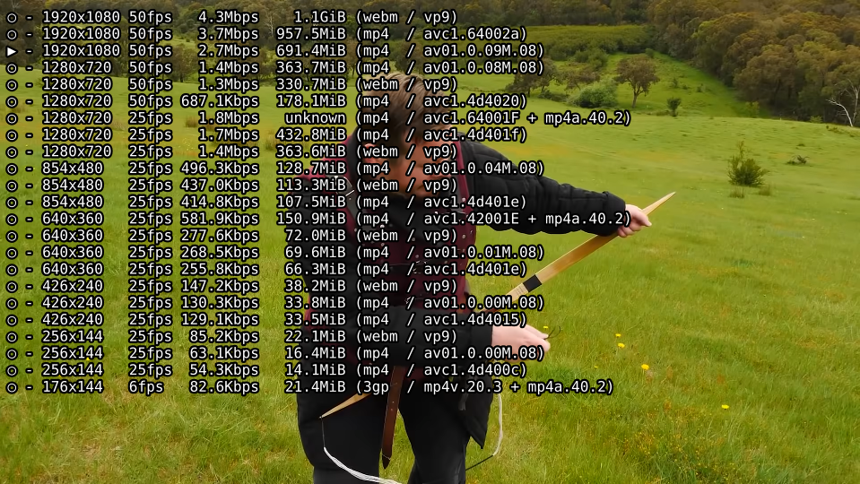
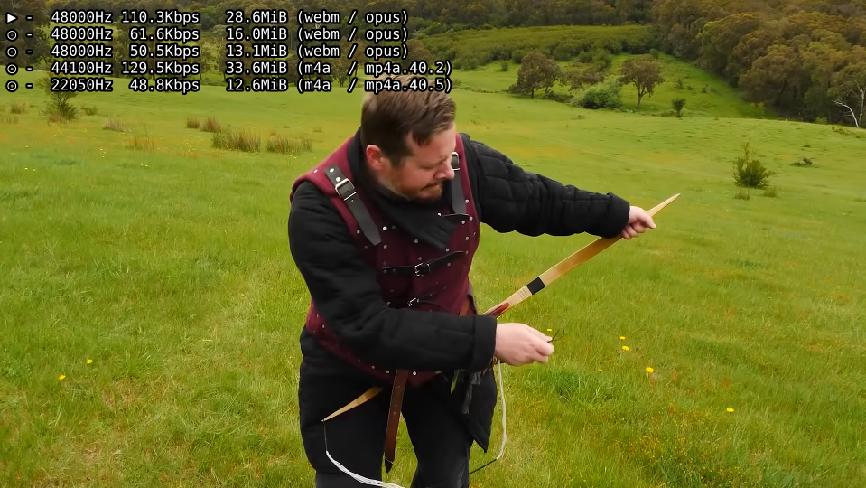

# youtube-quality
A userscript for MPV that allows you to change youtube video quality and audio quality (ytdl-format) on the fly.

Simply open the video or audio menu, select your prefered format and confirm your choice. The keybindings for opening the menus are configured in input.conf, and everthing else is configured in youtube-quality.conf.

## Installation
Copy youtube-quality.lua into your scripts directory, e.g.:

    cp youtube-quality.lua ~/.config/mpv/scripts/
optional, copy the config file:

    cp youtube-quality.conf ~/.config/mpv/script-opts/
set key bindings in input.conf:

    CTRL+f script-message-to youtube_quality video_formats_toggle
    ALT+f script-message-to youtube_quality audio_formats_toggle

## OSC extension
**Completely optional**, an extended version of the OSC is available that includes a button to display the quality menu.  To use this, copy the youtube-quality-osc.lua file into your scripts directory and put `osc=no` in your mpv.conf.

**PLEASE NOTE:** This conflicts with other scripts that modify the OSC, such as TheAMM's excellent [mpv_thumbnail_script](https://github.com/TheAMM/mpv_thumbnail_script).  Merging this OSC modification with that script or others is certainly possible, *but is left as an exercise for the user...*

## Plans For Future Enhancement
- [x] Visual indication of what the current quality level is.
- [x] Option to populate the quality list automatically with the exact formats available for a given video.
- [x] Optional OSC extension.
- [ ] Get formats from when mpv calls youtube-dl (yt-dlp) to get the video, instead of calling youtube-dl (yt-dlp) again.
- [ ] Keep data buffer of unchanged format (e.g. after selecting a new audio format, having to reload the already buffered video data is wasteful).
- [ ] *\[your suggestion here\]*

## Ask for help
I have no idea how to go about switching out the format for one stream, while retaining the other.
Any help would be highly appreciated.

## Credit
- [reload.lua](https://github.com/4e6/mpv-reload/), for the function to reload a video while preserving the playlist.
- [mpv-playlistmanager](https://github.com/jonniek/mpv-playlistmanager), for the menu formatting config.
- ytdl_hook.lua, much of the  code to fetch the format list with youtube-dl came from there.
- somebody on /mpv/ for the idea
